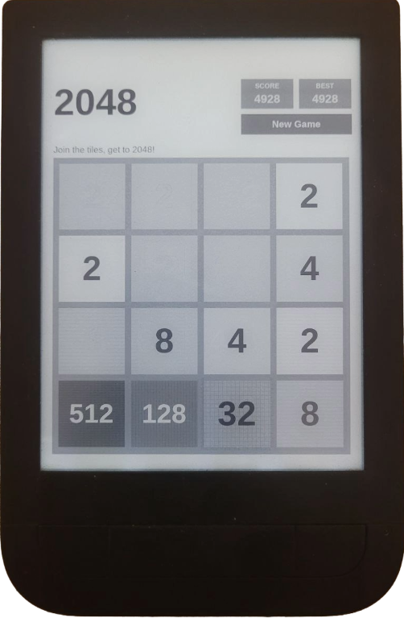

# 2048 for PocketBook

The classic [2048](https://en.wikipedia.org/wiki/2048_(video_game)) sliding tile puzzle, written in C for PocketBook e-readers using the InkView SDK.



## Features

- Smooth tile slide and merge animations
- Score and best score tracking (best score saved to disk)
- Portrait and landscape support with automatic orientation detection
- Scales to any screen resolution — works on both low-res (600×800) and high-res (1264×1680) devices
- Pure greyscale rendering suited for e-ink — no bitmaps, no external assets
- Written in plain C89 for maximum compatibility with the PocketBook toolchain

## Controls

**On device — touchscreen:**

| Input | Action |
|-------|--------|
| Swipe | Slide tiles in swipe direction |
| Tap "New Game" | Start a new game |
| Tap "Keep Going" / "Try Again" | Dismiss end-game overlay |

**On emulator — keyboard:**

| Input | Action |
|-------|--------|
| Arrow keys | Slide tiles |
| OK button | Confirm (Keep Going / New Game) |
| Next / Prev buttons | Slide right / left |

## Pre-built binaries

Ready-to-use binaries are included in the repository:

| File | Target |
|------|--------|
| `game2048.app` | PocketBook device — built for PB631 (ARM Linux) |
| `2048.exe` | PocketBook SDK emulator on Windows |

To install on a device, copy `game2048.app` to the `applications/` folder on your PocketBook's storage and restart the device.

## Building from source

The PocketBook SDK is included as a git submodule. Clone with:

```sh
git clone --recursive git@github.com:esix/2048-pocketbook.git
```

Or if you already cloned without submodules:

```sh
git submodule update --init
```

### For device (ARM Linux)

On Linux:

```sh
./makearm.sh
```

On Windows (requires `POCKETBOOKSDK` environment variable pointing to the SDK root):

```bat
makearm.bat
```

Produces `game2048.app`. Copy it to the `applications/` folder on the device.

### For SDK emulator (Windows)

Requires the PocketBook SDK for Windows and `POCKETBOOKSDK` set:

```bat
make.bat
```

Produces `2048.exe`. Run it alongside `cygpb1.dll` (included) using the PocketBook emulator.

## Project structure

```
src/
  game2048.c        Single-file game source (C89)
PocketBookSDK/      SDK submodule — ARM cross-compiler, headers, libraries
doc/
  running-on-device.png
game2048.app        Pre-built ARM binary (PB631)
2048.exe            Pre-built Windows emulator binary
cygpb1.dll          PocketBook emulator runtime (Windows)
makearm.sh          Build script for device (Linux)
makearm.bat         Build script for device (Windows)
make.bat            Build script for SDK emulator (Windows)
```

## License

[The Unlicense](LICENSE) — public domain, no restrictions.
